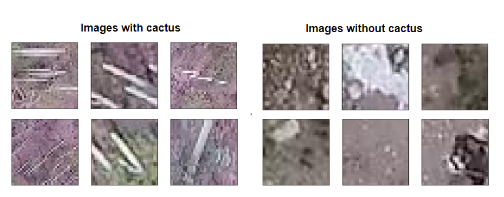

# Aerial Cactus Identification
Kaggle competition to find the presence of a columnar cactus in aerial imagery.
Link to competition: https://www.kaggle.com/c/aerial-cactus-identification

## Data
This dataset contains a large number of 32 x 32 thumbnail images containing aerial photos of a columnar cactus (Neobuxbaumia tetetzo). 
The 13136 images has the cactus and 4364 images without the cactus.

## Sample Images

